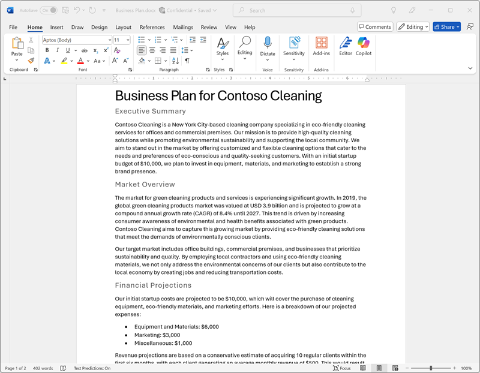

---
lab:
  title: Explorar o Microsoft 365 Copilot
---
# Explorar o Microsoft 365 Copilot

Bem-vindo ao emocionante mundo do Microsoft 365 Copilot!

Neste exercício, você utilizará o poder do Copilot para explorar uma nova ideia de negócio: iniciar uma empresa de limpeza corporativa.

Imagine o seguinte: você está prestes a lançar um serviço de limpeza de alto nível que revolucionará os espaços de escritório em todos os lugares. Com o Microsoft Copilot ao seu lado, você pesquisará tendências de mercado e desenvolverá um plano de negócios concreto. Mas isso não é tudo! Você também criará documentos interessantes, apresentações atraentes e emails persuasivos para ajudar a tirar sua ideia do papel e atrair investidores.

Prepare-se para liberar sua criatividade e perspicácia nos negócios enquanto navega por este laboratório envolvente e interativo. Ao final deste exercício, você terá um conjunto abrangente de materiais que o colocarão no caminho do sucesso empresarial. Vamos começar e tornar sua empresa de limpeza corporativa uma realidade!

> **Importante**: este exercício fornece prompts que você pode usar para trabalhar com o Copilot. Você deve usá-los como *ponto de partida* para explorar o Copilot. Incentivamos você a modificar esses prompts e adicionar seus próprios prompts para participar de um diálogo iterativo com o Copilot e refinar os resultados que ele produz. Talvez você não termine exatamente com a saída descrita nas instruções do exercício, mas não tem problema, o objetivo é experimentar o Copilot.

Este exercício levará aproximadamente **40** minutos para ser concluído.

> **Observação**: este exercício requer uma licença do **Microsoft 365 Copilot** da sua organização.

## Usar o Copilot para explorar um documento e pesquisar uma ideia

Para iniciar a exploração da IA generativa, vamos usar o Copilot para Word para examinar um documento existente e extrair alguns insights dele.

1. Em um navegador da web, abra o documento [Business Idea.docx](https://github.com/MicrosoftLearning/mslearn-copilot/raw/main/Allfiles/Business%20Idea.docx) em `https://github.com/MicrosoftLearning/mslearn-copilot/raw/main/Allfiles/Business%20Idea.docx`. 
1. Baixe o arquivo para sua pasta **Downloads**. Em seguida, feche o navegador da web.
1. **Mova** ou **copie e cole** o documento que você acabou de baixar para a pasta do **OneDrive**.
1. Na pasta do **OneDrive**, abra o **Business Idea.docx** no Microsoft Word (fechando mensagens de boas-vindas ou notificações de novos recursos) e examine o documento, que descreve algumas ideias de alto nível para um negócio de limpeza em Nova York. Se solicitado, selecione **Habilitar edição** na parte superior.

    > **Dica**: você pode fechar o painel **Navegação** se ele estiver aberto para ver mais do documento.

1. Localize e selecione o ícone do **Copilot** na barra de ferramentas do Word para abrir o painel Copilot, conforme mostrado aqui (seu tema visual pode variar):

    

1. No painel Copilot, insira o seguinte prompt na área de texto na parte inferior:

    ```prompt
    Summarize this document into 5 key points, and suggest next steps.
    ```

1. Examine a resposta do Copilot, que deve resumir os principais pontos do documento, conforme mostrado aqui:

    

    > A resposta específica recebida pode variar devido à natureza da IA generativa.

    Com esperança, o Copilot forneceu algumas orientações úteis. No entanto, se você tiver perguntas adicionais, basta solicitar informações mais específicas.

1. Retorne ao painel Copilot para fazer a seguinte pergunta ao Copilot:

    ```prompt
    How do I setup a new business in New York? Answer with a numbered list.
    ```

1. Examine a resposta e acrescente perguntas adicionais conforme necessário. Quando estiver contente com a resposta, copie-a para a área de transferência. Cole-o no documento do Word após o texto existente. Em seguida, selecione o texto que fornece uma lista de coisas a fazer ao abrir uma empresa em Nova Iorque e use o ícone do Copilot (na parte inferior do texto selecionado) para visualizar o texto como uma tabela.

    

1. Revise a tabela e peça ao Copilot para adicionar mais informações, como uma coluna com referências para obter mais detalhes.  Sua resposta deve ser semelhante a esta (talvez seja necessário usar o botão **Regenerar**):

    

    > **Importante**: A resposta gerada por IA baseia-se em informações publicamente disponíveis na Web. Embora possa ser útil para ajudá-lo a entender as etapas necessárias para iniciar um negócio, não há garantia de que seja 100% precisa e não substitui a necessidade de orientação profissional!

1. Quando estiver satisfeito com a tabela gerada pelo Copilot, selecione a opção para **Mantê-la**.

## Usar o Copilot para criar conteúdo para um plano de negócios

Agora que você fez algumas pesquisas iniciais, vamos fazer o Copilot ajudá-lo a desenvolver um plano de negócios para sua empresa de limpeza.

1. Com o documento **Business Idea.docx** ainda aberto, no painel Copilot, insira o seguinte prompt:

    ```prompt
    Can you suggest a name for my cleaning business?
    ```

1. Revise as sugestões e selecione um nome para sua empresa de limpeza (ou continue solicitando mais sugestões para encontrar um nome que você goste).
1. Criar um novo documento em branco. Em seguida, no novo documento, selecione o ícone Copiloto na margem para elaborar o novo conteúdo. Insira o seguinte prompt, substituindo **Contoso Cleaning** pelo nome da empresa de sua escolha:

    ```prompt
    Write a business plan for "Contoso Cleaning" based on the information in /Business Idea.docx. Include an executive summary, market overview, and financial projections.
    ```

    

    > **Dica**: digite o prompt e, quando você digitar "/", o Copilot deve permitir que você navegue pelos documentos na pasta do OneDrive. Se o Copilot não sugerir nenhum documento, pode ser porque seu OneDrive ainda não foi totalmente indexado. Nesse caso, modifique o prompt para `Write a business plan for "Contoso Cleaning", a commercial cleaning business in New York. Include an executive summary, market overview, and financial projections.`.

1. Gere e revise uma resposta. Em seguida, mantenha-o, ajuste o tom, o comprimento ou peça ao Copilot para reescrevê-lo com um novo prompt. Aplique títulos e estilo apropriados ao seu documento para torná-lo profissional antes de salvá-lo como **Business Plan.docx** em sua pasta OneDrive. Seu documento deve ficar mais ou menos assim:

    

## Visualizar projeções financeiras no Copilot para Excel

Com um plano de negócios em mãos, vamos pegar alguns desses dados sobre projeções financeiras e pedir ao Copilot no Excel para visualizar esses dados para nós, para que possamos incluí-los em emails ou apresentações para investidores.

1. Com o documento **Business Plan** aberto no Microsoft Word, abra o painel Copiloto.
1. Se o plano de negócios que foi gerado incluiu uma lista de lucros projetados, insira o seguinte prompt:

    ```prompt
    Create a table of the projected profits in this document.
    ```

    Caso contrário, insira este prompt:

    ```prompt
    Create a table of projected profits for the next 5 years, starting with this year. The profit this year should be $10,000 and it should increase by 12% each year.
    ```

1. Copie a tabela de lucros projetados para a área de transferência.
1. Abra o **Excel** e crie uma nova pasta de trabalho em branco. Salve imediatamente a pasta de trabalho como **Financial Projections.xlsx** na sua pasta OneDrive.
1. Cole a tabela de projeções de lucro na planilha do Excel e **formate-a como uma tabela**. Para fazer isso:
    1. Selecione uma **célula** dentro de seus dados.
    1. Selecione **Página Inicial** e escolha **Formatar como Tabela** em Estilos. 
    1. Escolha um estilo para sua tabela.
    1. Na caixa de diálogo **Criar Tabela**, confirme ou defina o intervalo de células.
    1. Marque se a tabela tiver cabeçalhos e selecione **OK**.
1. Com as projeções de vendas formatadas como uma tabela, abra o painel do Copilot na guia **Página Inicial** da faixa de opções do Excel e insira a seguinte solicitação:

    ```prompt
    Suggest ways to visualize these financial projections.
    ```
    
1. O Copilot deve sugerir uma maneira de visualizar seus dados e oferecer para adicionar um gráfico dinâmico a uma nova planilha.

    

    > **Dica**: se o Copilot sugerir um formato diferente para os dados, insira o prompt de acompanhamento `Visualize the data as a line chart.`.

1. Selecione a opção na resposta do Copilot para adicionar o gráfico dinâmico a uma nova planilha e abri-la. Selecione o gráfico e selecione **Design** para aplicar estilos, alterar o tipo de gráfico e outras ações. No final, você deve ter algo semelhante a isto:

    

1. Salve a pasta de trabalho e feche o Excel.

## Usar o Copilot para criar conteúdo para uma apresentação

Com a ajuda do Copilot, você criou um rascunho de um plano de negócios para a ideia de negócios de limpeza e preparou algumas projeções financeiras. Agora você precisará de uma apresentação eficaz para comunicar os benefícios do seu negócio.

1. Abra o **PowerPoint** e crie uma nova **apresentação em branco**. Se o painel **Designer** for aberto automaticamente, feche-o.
1. Salve a apresentação como **Cleaning Company.pptx** na pasta do OneDrive.
1. Selecione o **botão Copilot** na **guia Página Inicial** da faixa de opções, selecione **Criar apresentação sobre...** e, em seguida, preencha o prompt no painel Copilot da seguinte maneira:

    ```prompt
    Create a presentation about a corporate cleaning service named "Contoso Cleaning" in New York City. The presentation should include the benefits of using a professional cleaning business.
    ```
1. Examine o design da apresentação e selecione **Gerar slides**.

    
1. O Copilot irá gerar slides na apresentação.  O processo pode levar vários minutos e sua saída deve ser semelhante a esta com um tema diferente:

    

1. Selecione **Manter** e, em seguida, defina seu **modo de exibição** como **normal** no canto inferior direito da apresentação do PowerPoint 

1. Selecione o penúltimo slide da apresentação (antes do final slide de *Conclusão* se o Copilot gerou um). Em seguida, no painel Copilot, na caixa de chat, solicite a criação de um novo slide usando o prompt `Add a slide about the benefits of an eco-friendly approach to cleaning.`

    

1. Salve a apresentação e feche o PowerPoint.

## Use o Copilot para organizar uma reunião de financiamento

Você criou alguns materiais de apoio para ajudar a iniciar seu negócio. Agora é hora de entrar em contato com um investidor em busca de financiamento de startup.

1. Abra **Outlook** e, na barra de título, use o ícone **Copilot** para abrir o painel Copilot.
1. Mude para a página **Calendário** e altere a visualização para **Semana de trabalho**. Se você ainda não tem nenhum evento agendado em seu calendário para esta semana, você pode adicionar alguns para que o Copilot tenha algumas informações para trabalhar.
1. No painel do Copilot, insira o seguinte prompt:

    ```
    What events do I have scheduled this week?
    ```

    O Copilot deve responder com um resumo de seus eventos agendados para a semana, ajudando você a identificar a disponibilidade para uma reunião com um gerente de banco para providenciar o financiamento inicial.

1. Mude para a página **Mail** e crie um novo email e preencha a caixa **Para** com seu próprio endereço de email.
1. Selecione a opção para **Rascunho com Copilot**:

    
    
1. Insira o seguinte prompt para gerar um rascunho de email:

    ```prompt
    Write an email to a bank manager requesting a meeting to discuss funding for a commercial cleaning business. The email should be concise and the tone should be professional.
    ```

1. Use o Copilot para refinar o conteúdo do email e, em seguida, selecione **Manter** para finalizar a mensagem.

    

1. Você pode enviar o email para o seu próprio endereço, se quiser!

## Desafio

Agora que você viu como usar o Microsoft 365 Copilot para pesquisar ideias e gerar conteúdo, por que não tentar explorar mais? 

Com base no que você aprendeu neste exercício, tente usar o Copilot para planejar uma reunião na qual você proporá a adoção da IA generativa em sua organização. Veja aqui algumas ideias para começar:

- Pesquise os benefícios da IA generativa e do Microsoft Copilot para empresas, encontrando informações sobre benefícios de produtividade, economia de custos e exemplos de organizações que já adotaram a IA com sucesso.
- Crie um documento de discussão que você possa circular como pré-leitura antes da reunião.
- Crie uma apresentação que você possa usar para apresentar seu caso, incluindo dados e visualizações para enfatizar os principais elementos do seu argumento de venda.
- Escreva um email para informar seus colegas de trabalho sobre a reunião e fornecer um contexto para ela.

Seja tão inventivo quanto quiser e explore como o Copilot pode ajudá-lo a encontrar informações, gerar e aprimorar textos, criar imagens e responder perguntas.

## Conclusão

Neste exercício, você usou o [Microsoft 365 Copilot](https://www.microsoft.com/microsoft-365/enterprise/copilot-for-microsoft-365) para encontrar informações e gerar conteúdo. Espero que você tenha visto como usar a IA generativa em um Copilot pode ajudar na produtividade e criatividade. O Microsoft 365 permite que você traga o poder da IA gerativa para seus dados e processos empresariais, ao mesmo tempo em que se integra à sua infraestrutura de TI existente para garantir uma solução gerenciável e segura.
