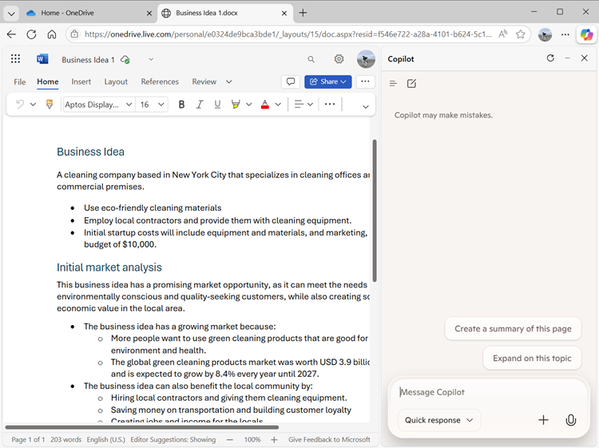

---
lab:
  title: Explorar o Copilot no Microsoft Edge
---
# Explorar o Microsoft Copilot no Microsoft Edge

Bem-vindo ao emocionante mundo do Microsoft Copilot!

Neste exercício, você utilizará o poder do Copilot para explorar uma nova ideia de negócio: iniciar uma empresa de limpeza corporativa.

Imagine o seguinte: você está prestes a lançar um serviço de limpeza de alto nível que revolucionará os espaços de escritório em todos os lugares. Com o Microsoft Copilot ao seu lado, você pesquisará tendências de mercado e desenvolverá um plano de negócios concreto. Mas isso não é tudo! Você também criará documentos interessantes, apresentações atraentes e emails persuasivos para ajudar a tirar sua ideia do papel e atrair investidores.

Prepare-se para liberar sua criatividade e perspicácia nos negócios enquanto navega por este laboratório envolvente e interativo. Ao final deste exercício, você terá um conjunto abrangente de materiais que o colocarão no caminho do sucesso empresarial. Vamos começar e tornar sua empresa de limpeza corporativa uma realidade!

> **Importante**: este exercício fornece prompts que você pode usar para trabalhar com o Copilot. Você deve usá-los como *ponto de partida* para explorar o Copilot. Incentivamos você a modificar esses prompts e adicionar seus próprios prompts para participar de um diálogo iterativo com o Copilot e refinar os resultados que ele produz. Talvez você não termine exatamente com a saída descrita nas instruções do exercício, mas não tem problema, o objetivo é experimentar o Copilot.

Este exercício levará aproximadamente **40** minutos para ser concluído.

> **Observação**: esse exercício pressupõe que você tenha uma [Conta Microsoft pessoal](https://signup.live.com) (como uma conta do outlook.com) com a qual fez login no [Microsoft Edge](https://www.microsoft.com/edge/download) no seu computador. Se você tiver uma conta corporativa e uma conta pessoal, certifique-se de selecionar sua conta *pessoal* nas configurações da conta no canto superior esquerdo do Microsoft Edge.

## Usar o Copilot para explorar um documento e pesquisar uma ideia

Para iniciar sua exploração da IA generativa, vamos usar o Microsoft Copilot no Edge para examinar um documento existente e extrair alguns insights.

1. No Microsoft Edge, navegue até o [OneDrive](https://onedrive.live.com) em `https://onedrive.live.com` e entre usando sua conta pessoal da Microsoft. Feche as mensagens de boas-vindas ou ofertas que aparecem.
1. Em outra guia do navegador, abra o documento [Business Idea.docx](https://github.com/MicrosoftLearning/mslearn-copilot/raw/main/Allfiles/Business%20Idea.docx) de `https://github.com/MicrosoftLearning/mslearn-copilot/raw/main/Allfiles/Business%20Idea.docx`. Em seguida, quando o documento for aberto no Edge, selecione a opção **Editar uma cópia** para copiar o documento para o OneDrive. O documento deve ser aberto em seguida no Microsoft Word online automaticamente.

    > **Dica**: se você não vir a opção de editar uma cópia, baixe-a para o seu computador local. Em seguida, no OneDrive, use o botão **+ Adicionar novo** para carregar o arquivo **Business Idea.docx** do seu computador local para o OneDrive.

1. Veja o texto no documento **Ideia de Negócio**, que descreve algumas ideias de alto nível para um negócio de limpeza na cidade de Nova Iorque.
1. Use o ícone do **Copilot** na barra de ferramentas do Edge para abrir o painel do Copilot, conforme mostrado aqui:

    

    > **Dica**: o Microsoft Copilot é aprimorado continuamente. Sua interface de usuário pode não corresponder exatamente à imagem mostrada.

1. Na caixa do chat, na parte inferior do painel do Copilot, insira o seguinte prompt:

    ```prompt
    Summarize this document into 5 key points, and suggest next steps.
    ```

    Se solicitado, confirme que você quer permitir que o Copilot acesse a página.

1. Revise a resposta do Copilot, que deve resumir os principais pontos do documento e sugerir algumas ações de acompanhamento a serem tomadas, conforme mostrado aqui:

    

    > **Observação**: a resposta específica pode variar.

    Com esperança, o Copilot forneceu algumas orientações úteis. No entanto, se você tiver perguntas adicionais, basta solicitar informações mais específicas.

1. Digite o seguinte prompt:

    ```prompt
    How do I go about setting up a business in New York?
    ```

1. Revise a resposta, que deve conter alguns conselhos e links para recursos para ajudá-lo a começar a montar um negócio em Nova Iorque.

    > **Importante**: a resposta gerada pela IA se baseia em informações publicamente disponíveis na web. Embora possa ser útil para ajudar você a entender as etapas necessárias para estabelecer uma empresa, não podemos garantir que seja 100% precisa e não deve substituir a necessária consultoria profissional.

## Usar o Copilot para criar conteúdo para um plano de negócios

Agora que você já fez algumas pesquisas iniciais, vamos pedir ao Copilot para ajudar você a desenvolver um plano de negócios para a sua empresa de limpeza.

1. Com o documento **Business Idea.docx** ainda aberto no Microsoft Edge, insira o seguinte prompt no painel do Copilot:

    ```prompt
    Suggest a name for my cleaning business.
    ```

1. Revise as sugestões e selecione um nome para sua empresa de limpeza (ou continue solicitando mais sugestões para encontrar um nome que você goste). Depois de escolher um, informe ao Copilot qual é, por exemplo, digite `Let's go with the first one.`.
1. Certifique-se de que o documento **Business Idea** ainda esteja aberto na página principal do navegador e insira o seguinte prompt:

    ```prompt
    Based on the contents of this document, create a business plan for my cleaning business.
    ```

1. Analise a resposta. Em seguida, no painel do Microsoft Word, no menu **Arquivo**, crie um novo documento em branco. Feche o painel **Designer** se ele abrir e altere o nome do novo documento de *Documento* para `Business Plan`.
1. Copie o plano de negócios gerado no painel do Copilot e cole-o no documento do plano de negócios, removendo qualquer conteúdo desnecessário do Copilot:

    

1. No painel do Copilot, insira o seguinte prompt:

    ```prompt
    Create a corporate logo for the cleaning company. The logo should be round and include an iconic New York landmark.
    ```

1. Revise a imagem que o Copilot gerou.

1. Use mais instruções para iterar no design (por exemplo, `Make it green and blue`) até obter um logotipo de que goste.

    > **Dica**: quando o Coplot gera imagens que contêm texto, você pode notar alguns erros de ortografia. Experimente diferentes prompts até ficar satisfeito com os resultados.

1. Clique com o botão direito do mouse no logotipo gerado e copie-o para a área de transferência. Em seguida, cole-o na parte superior do documento do plano de negócios, assim:

    

1. Feche as guias do navegador do Microsoft Word e retorne ao OneDrive.

## Use o Copilot para gerar e visualizar projeções financeiras

Com a ajuda do Copilot, você criou um rascunho de um plano de negócios para a sua ideia de uma empresa de limpeza. Agora vamos usar o Copilot para realizar alguns cálculos que ajudarão a refinar ainda mais o plano de negócios.

1. No painel do Copilot, insira o seguinte prompt:

    ```prompt
    Create a table of projected profits for the next 5 years, starting with this year. The profit this year should be $10,000 and it should increase by 12% each year.
    ```

1. Revise a resposta, que deve incluir uma tabela de lucros projetados para os próximos cinco anos.
1. Se uma opção para editar a tabela no Excel for mostrada, selecione-a para criar uma nova pasta de trabalho com a tabela de dados. Caso contrário, retorne à guia OneDrive e use o botão **(+)** para adicionar uma nova **pasta de trabalho do Excel**. Em seguida, copie a tabela de dados do painel do Copilot para a pasta de trabalho.

1. Altere o nome da pasta de trabalho para `Financial projections`. Ela deve ser semelhante a este:

    

1. No painel do Copilot, insira o seguinte prompt:

    ```prompt
    What's a good way to visualize these projections in a chart?
    ```

1. Revise a resposta, que deve recomendar algumas maneiras de visualizar os dados das projeções. Insira o seguinte prompt:

    ```prompt
    How do I create a line chart in Excel?
    ```

1. Siga as orientações fornecidas pelo Copilot para criar um gráfico de linhas.

    > **Dica**: pode ser necessário ajustar o eixo de dados padrão selecionado pelo Excel. Selecione o gráfico na planilha e, na guia **Gráfico**, selecione **Selecionar Dados**. Em seguida, no painel **Gráfico**, na guia **Dados**, modifique a configuração para que o campo **Ano** seja o rótulo horizontal e apenas o campo **Lucro Projetado** seja usado como um valor de linha:

    

1. Feche a guia **Gráfico** para ver o gráfico na planilha.

1. Feche a guia do navegador do Microsoft Excel e retorne ao OneDrive.

## Usar o Copilot para criar conteúdo para uma apresentação

Graças ao Copilot, você criou um plano de negócios para o negócio de limpeza e gerou algumas projeções financeiras. Agora você precisará de uma apresentação eficaz para convencer um investidor a lhe emprestar o dinheiro necessário para começar a empresa.

1. No OneDrive, adicione uma nova **apresentação do PowerPoint**. Se o painel do **Designer**abrir automaticamente, feche-o. Em seguida, altere o nome da apresentação de *Apresentação* para `Business Presentation`.

1. No slide de título da apresentação, insira o nome da sua empresa de limpeza como título e `Investor Opportunity` como subtítulo.
1. Insira um novo slide, usando o layout de slide **Dois Conteúdos** (que inclui um título e dois espaços reservados para o conteúdo).
    

1. Altere o título do slide para `Benefits of Hiring a Commercial Cleaner`.
1. No painel do Copilot, insira o seguinte prompt:

    ```prompt
    Write a summary of the benefits of using a corporate cleaning company for your business. The summary should consist of five short bullet points.
    ```

1. Copie a resposta do Copilot para a área de transferência e cole-a no espaço reservado para o conteúdo no lado esquerdo. Em seguida, edite e reformate o texto no espaço reservado até ficar satisfeito.
1. No painel do Copilot, insira o seguinte prompt:

    ```prompt
    Create a photorealistic image of a clean office.
    ```

1. Quando o Copilot gerar uma imagem que lhe agradar, você deve copiá-la para a área de transferência e colá-la no espaço reservado para o conteúdo no lado direito do slide.

    Se o painel do **Designer** abrir automaticamente, selecione um design de slide que lhe agrade. Em seguida, feche o painel do **Designer**.

1. Aplique qualquer reformatação adicional que você ache necessária até que você tenha um slide com o qual esteja satisfeito:

    

1. Abra uma nova guia do navegador e use-a para baixar a imagem [mopping.png](https://github.com/MicrosoftLearning/mslearn-copilot/raw/main/Allfiles/mopping.png) de `https://github.com/MicrosoftLearning/mslearn-copilot/raw/main/Allfiles/mopping.png` para o seu computador local, salvando-a em qualquer pasta.
1. Volte para a guia do navegador que contém sua apresentação do PowerPoint e, no painel Copilot, use o botão **+** ao lado da caixa de chat para fazer upload da imagem **mopping.png** no Copilot e adicione o prompt `What does this image show?`.
1. Revise a resposta, que deve ser semelhante a esta:

    

1. Continue com o seguinte prompt e revise a resposta:

    ```prompt
    Would this image be helpful to promote a commercial cleaning business?
    ```

    O Copilot analisou a imagem e avaliou sua utilidade para o seu cenário de negócios específico da mesma forma que você pode pedir a opinião de um colega.

1. No PowerPoint, adicione um novo slide com o mesmo layout **Dois Conteúdos** de antes. Em seguida, em um dos espaços reservados de conteúdo, carregue a imagem **mopping.png** para adicioná-la ao slide.

1. No painel do Copilot, insira o seguinte prompt:

    ```prompt
    Write a short paragraph to accompany this image, emphasizing the professionalism of the cleaning staff we employ.
    ```

1. Revise o texto resultante e copie-o para o espaço reservado de conteúdo vazio no slide, editando-o e formatando-o conforme achar necessário.
1. No painel do Copilot, insira o seguinte prompt:

    ```prompt
    Suggest a good title for a slide that contains the image and text.
    ```

1. Use o título sugerido para o slide e, em seguida, use o Designer no PowerPoint para formatar o slide. Você deve terminar com um slide semelhante a este:

    

1. Feche a guia do navegador do PowerPoint e retorne ao seu OneDrive.

## Use o Copilot para organizar uma reunião de financiamento

Você criou alguns materiais de apoio para ajudar a iniciar seu negócio. Agora é hora de entrar em contato com um investidor em busca de financiamento de startup.

1. Use o **Inicializador de Aplicativos** (&#8759;) na ponta esquerda da barra de título do OneDrive para abrir o **Outlook**.

1. Na página **Email**, crie um novo email. Preencha a caixa **Para** com seu próprio endereço de email e defina o **Assunto** como `Business funding meeting request`.
1. No painel do Copilot, insira o seguinte prompt:

    ```prompt
    Write an email to a bank manager requesting a meeting to discuss funding for a commercial cleaning business. The email should be concise and the tone should be professional.
    ```
    
1. Use o conteúdo gerado para preencher seu email, conforme mostrado aqui:

    

    Você pode enviar o email para o seu próprio endereço, se quiser!

## Desafio

Agora que você já viu como usar o Copilot para pesquisar ideias e gerar conteúdo, por que não tenta explorar ainda mais? Para iniciar uma nova sessão do Copilot, no menu **+** ao lado da caixa de chat, selecione **Iniciar novo chat**. Em seguida, com base no que você aprendeu neste exercício, tente usar o Copilot para planejar uma reunião na qual você proporá a adoção da IA generativa em sua organização. Veja aqui algumas ideias para começar:

- Pesquise os benefícios da IA generativa e do Microsoft Copilot para empresas, encontrando informações sobre benefícios de produtividade, economia de custos e exemplos de organizações que já adotaram a IA com sucesso.
- Crie um documento de discussão que você possa circular como pré-leitura antes da reunião.
- Crie uma apresentação que você possa usar para apresentar seu caso, incluindo dados e visualizações para enfatizar os principais elementos do seu argumento de venda.
- Escreva um email para informar seus colegas de trabalho sobre a reunião e fornecer um contexto para ela.

Seja tão inventivo quanto quiser e explore como o Copilot pode ajudá-lo a encontrar informações, gerar e aprimorar textos, criar imagens e responder perguntas.

## Conclusão

Nesse exercício, você usou o Copilot no Microsoft Edge para encontrar informações e gerar conteúdo. Espero que você tenha entendido como usar a IA generativa em um Copilot pode ajudar a aumentar sua produtividade e criatividade.

Embora os serviços gratuitos usados nesses exercícios sejam, sem dúvida, muito poderosos, você pode conseguir ainda mais com serviços como [Microsoft 365 Copilot](https://www.microsoft.com/microsoft-365/enterprise/copilot-for-microsoft-365), nos quais o Microsoft Copilot é integrado aos aplicativos de produtividade do Windows e do Microsoft Office, fornecendo ajuda altamente contextualizada com tarefas comuns. O Microsoft 365 permite que você adicione o poder da IA generativa aos seus dados e processos de negócios e, ao mesmo tempo, integre o recurso à sua infraestrutura de TI existente para garantir uma solução segura e fácil de usar.